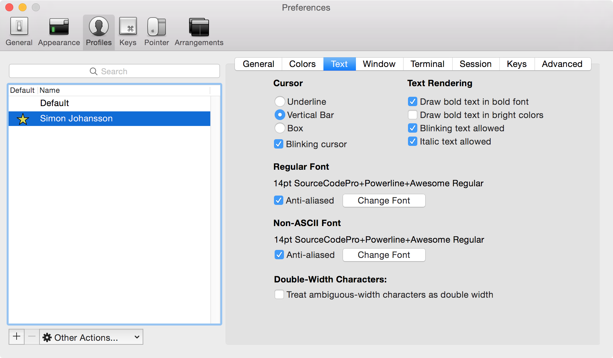
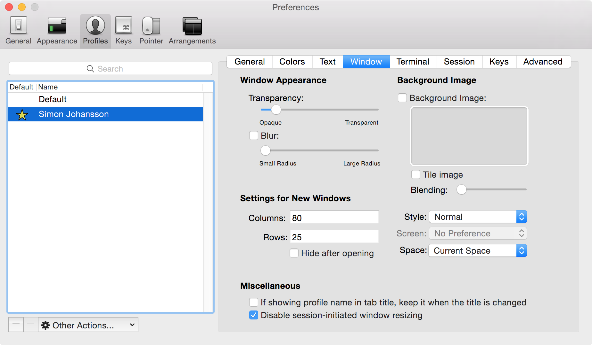
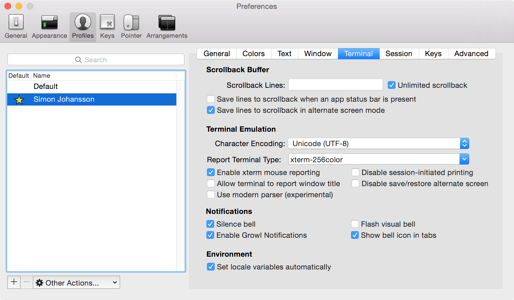

# .dotfiles

> My dotfile setup on OSX. Probably not terribly interesting for anyone besides myself.

## On a new machine

```bash
# 1. Set zsh as the defulat shell
$ chsh -s $(which zsh)
```

```bash
# 2. Clone this repo to ~/
$ cd ~ && git clone https://github.com/simon-johansson/.dotfiles.git && cd .dotfiles/
```

```bash
# 3. Install Homebrew & Casks + formulas
$ zsh installers/brew.sh
```

```bash
# 5. Create symlinks to `~/` for files in `symlinks/` folder
$ rcup -d symlinks -v
# Close the current terminal/iTerm window tab and open a new one after finishing
# this step to access the symlinked dotfiles and install all zsh plugins
```

```bash
# Install global Node.js modules
$ zsh installers/npm.sh
```

```bash
# Install global Ruby gems
$ zsh installers/gem.sh
```

#### Other things that needs to be done

* Set OSX settings (screenshots folder, keyboard repeat rate, etc.): [https://github.com/mathiasbynens/dotfiles/blob/master/.macos](https://github.com/mathiasbynens/dotfiles/blob/master/.macos)
* Change caps-lock key to be ctrl
* Change direction of trackpad scroll
* Set default download folder to `/tmp`
* Create a `~/Projects` folder with `work/` and `personal/` subfolders
* Set shortcut `⌘ + <` to "Move focus to next window"
* [Generate SSH keys](https://help.github.com/articles/generating-ssh-keys/)
* Install [nativefier](https://github.com/jiahaog/nativefier) and make apps for Gmail and Outlook
* In `/private/etc/hosts` file, put `127.0.0.1 localhost l`.
* Install [WebViewScreenSaver](https://github.com/liquidx/webviewscreensaver)

<!--
## Restoring application settings
Syncing application settings between mac:s is done with [mackup](https://github.com/lra/mackup) using Dropbox.

Before restoring, make sure that:

* You have installed Dropbox and synced your account
* You are fine with overwriting your current application settings

```bash
$ mackup restore
```
 -->

#### Alfred
Open Alred > Preferences. Then `Set sync folder...` to Dropbox folder `Dropbox/Alfred/`.

## Configure iTerm
* Open iTerm preferences and set "Load preferences from a custom folder or URL" to `~/.dotfiles/iterm`.
* Create a new user under "Profiles" and set as default
* Import `colors.itermcolors`, located in `~/.dotfiles/iterm`, as custom color scheme for some fancy colors.
* [Setup iTerm 2 to work with normal Mac OSX keyboard shortcuts](http://elweb.co/making-iterm-2-work-with-normal-mac-osx-keyboard-shortcuts/)






## Sublime Text Package Control
Install [Package Control](https://packagecontrol.io/installation), the package manager for Sublime, in order to install packages.

## Updating
Run the following command once in a while
```bash
$ update_everything
```
It will:
* Update Homebrew and installed formulas
* Update ZSH plugins with Antigen
* Update NPM modules and Node to the latest stable version

## License
MIT
