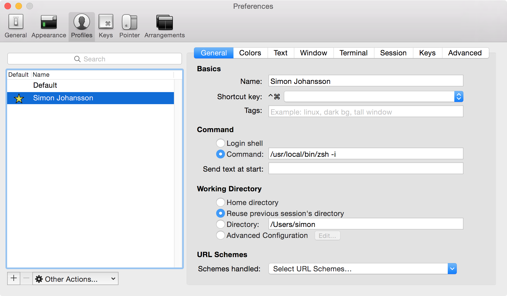

# .dotfiles

> My dotfile setup on OSX. Probably not be terribly interasting for anyone besides myself.

## On a new machine

```bash
# 1. Set zsh as the defulat shell
$ chsh -s $(which zsh)
```

```bash
# 2. Clone this repo to ~/
$ cd ~ && git clone https://github.com/simon-johansson/.dotfiles.git && cd .dotfiles/
```

```bash
# 3. Install Homebrew & Casks + formulas
$ zsh installers/brew.sh
```

```bash
# 4. Install ZSH plugins using Antigen
$ zsh installers/zsh.sh
```

```bash
# 5. Create symlinks to `~/` for files in `symlinks/` folder
$ rcup -d symlinks -v
# Close the current terminal/iTerm window tab and open a new one after finishing
# this step to access the symlinked dotfiles and install all zsh plugins
```

```bash
# Install global Node.js modules
$ zsh installers/npm.sh
```

```bash
# Install global Ruby gems
$ zsh installers/gem.sh
```

```bash
# Install fonts needed for oh-my-git zsh theme
$ zsh installers/fonts.sh
```

```bash
# Set OSX settings (screenshots folder, keyboard repeat rate, etc.)
$ zsh <(curl -s 'https://gist.githubusercontent.com/brandonb927/3195465/raw/1ec980e6803610791d36e45e1fc5a9ce3cd40507/osx-for-hackers.sh')
```

#### Other things that needs to be done

* Change caps-lock key to be ctrl
* Change direction of trackpad scroll
* Set default download folder to `/tmp`
* Create a `~/Projects` folder
* Set `⌘ + <` to switch between windows
* Create SSH-keys

## Restoring application settings
Syncing application settings between mac:s is done with [mackup](https://github.com/lra/mackup) using Dropbox.

Before restoring, make sure that:

* You have installed Dropbox and synced your account
* You are fine with overwriting your current application settings

```bash
$ mackup restore
```

#### Alfred
Open Alred > Preferences. Then `Set sync folder...` to Dropbox folder.

## Configure iTerm
* Open iTerm preferences and set "Load preferences from a custom folder or URL" to `~/.dotfiles/iterm`.
* Create a new user under "Profiles" and set as default
* Import `colors.itermcolors`, located in `~/.dotfiles/iterm`, as custom color scheme for some fancy colors.
* [Setup iTerm 2 to work with normal Mac OSX keyboard shortcuts](http://elweb.co/making-iterm-2-work-with-normal-mac-osx-keyboard-shortcuts/)




## Sublime Text Package Control
Install [Package Control](https://packagecontrol.io/installation), the package manager for Sublime, in order to install packages.

## Updating
Run the following command once in a while
```bash
$ update_everything
```
It will:
* Update Homebrew and formulas
* Update Zsh plugins with Antigen
* Update Node to the latest stable version

## License
MIT
